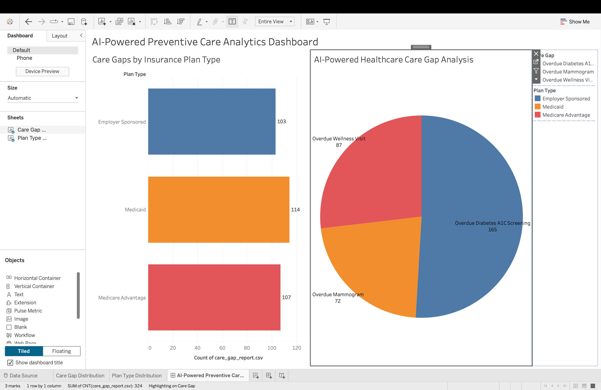

# AI-Powered Preventive Care & Healthcare Claims Analytics Platform

> An end-to-end analytics platform that identifies preventive care gaps, monitors healthcare utilization trends, and surfaces population health insights — built with Python, SQL, and Tableau.

---

## Why I Built This

In my work as a healthcare data analyst, one pattern kept showing up: members were slipping through the cracks on preventive care — not because the system didn't care, but because nobody had a clear, actionable view of who needed outreach and when.

This project is my attempt to build that visibility from scratch. Starting from raw claims and eligibility data, it flags members overdue for screenings like mammograms, diabetes A1C tests, and annual wellness visits, then surfaces those findings through dashboards that care management teams can actually act on.

It closely mirrors the workflows I've worked with across Medicare Advantage and commercial health plans — just rebuilt end-to-end in a way I could share.

---

## What It Does

- **Identifies care gaps** — finds members overdue for preventive services using claims history and cohort logic
- **Analyzes utilization trends** — breaks down inpatient, outpatient, and pharmacy service demand over time
- **Summarizes procedure costs** — aggregates claim amounts by CPT code, DRG category, and service type
- **Visualizes everything in Tableau** — interactive dashboards for care gap distribution, plan comparisons, and population health KPIs

---

## Tech Stack

| Layer | Tools |
|---|---|
| Data Generation | Python, Faker |
| Database | SQLite, SQL |
| Analytics Pipeline | Python, Pandas, NumPy |
| Visualization | Tableau Public |
| Version Control | Git, GitHub |

---

## Project Structure

```
healthcare_claims_analytics/
│
├── data/
│   ├── raw/
│   │   ├── claims.csv           # Simulated claims records
│   │   └── members.csv          # Member demographics & eligibility
│   └── processed/               # Cleaned and transformed outputs
│
├── reports/
│   ├── care_gap_report.csv       # Members flagged for preventive outreach
│   ├── utilization_summary.csv   # Service utilization by category
│   └── procedure_cost_summary.csv
│
├── sql/
│   └── 01_create_tables.sql      # Database schema
│
├── src/
│   ├── generate_sample_data.py   # Synthetic data generation
│   ├── load_database.py          # Load CSVs into SQLite
│   └── analytics_pipeline.py    # Core analytics logic
│
├── screenshots/
│   ├── final_dashboard.png
│   ├── care_gap_distribution.png
│   └── insurance_plan_analysis.png
│
├── main.py
├── requirements.txt
└── README.md
```

---

## Getting Started

**Clone the repository**
```bash
git clone https://github.com/kavyasruthi58/healthcare-claims-analytics-platform.git
cd healthcare-claims-analytics-platform
```

**Install dependencies**
```bash
pip install -r requirements.txt
```

**Generate sample data**
```bash
python src/generate_sample_data.py
```

**Load the database**
```bash
python src/load_database.py
```

**Run the analytics pipeline**
```bash
python src/analytics_pipeline.py
```

Reports will be written to the `/reports` folder. Open the Tableau workbook to explore the dashboards.

---

## Analytics Outputs

### Care Gap Report
Flags members who haven't had a qualifying claim for key preventive services within the recommended timeframe — organized by service type (mammogram, A1C screening, annual wellness visit), member demographics, and insurance plan.

### Utilization Summary
Aggregates healthcare service usage across inpatient, outpatient, and pharmacy categories. Useful for spotting shifts in care patterns over time.

### Procedure Cost Summary
Breaks down total and average claim amounts by procedure. Highlights high-cost service categories that represent the largest share of overall spend.

---

## Tableau Dashboard

The Tableau dashboard brings the analytics layer to life with four core views:

- **Care Gap Distribution** — which member segments are most overdue for preventive care
- **Plan Comparison** — preventive care engagement rates across Medicare Advantage, Medicaid, and employer plans
- **Utilization Trends** — how service demand has shifted month over month
- **Population Health KPIs** — high-level metrics for care management teams

---

## Dashboard Preview



---

## Relevance to Real-World Healthcare Analytics

The workflows in this project aren't hypothetical — they reflect the kind of analysis that population health teams, care management organizations, and payer analytics teams run regularly:

- Identifying members for preventive outreach campaigns
- Monitoring care gap closure rates against HEDIS benchmarks
- Supporting utilization management and cost containment discussions
- Building reporting infrastructure for clinical and operational stakeholders

---

## What's Next

A few enhancements I'm planning to build on top of this foundation:

- **Streamlit app** — turn the analytics pipeline into an interactive web interface
- **OpenAI-powered chatbot** — let users query claims data in plain English ("Which members haven't had a wellness visit this year?")
- **HEDIS measure expansion** — add more quality measures beyond the current three
- **CMS Medicare data integration** — swap simulated data for real public datasets from data.cms.gov
- **Predictive risk scoring** — use member history to flag who's likely to become a high-cost member

---

*Built with Python, SQL, and Tableau · Simulated data only · No PHI used*
